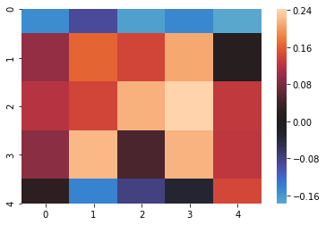
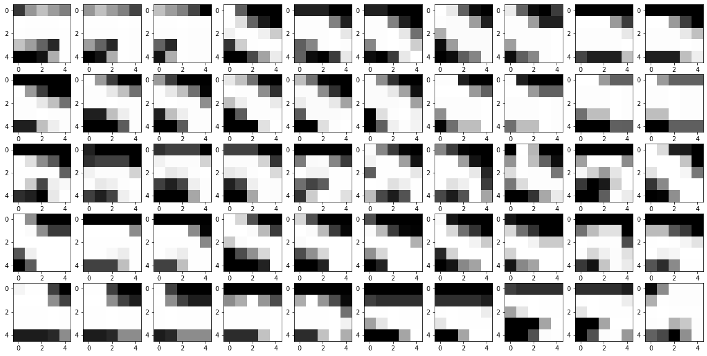
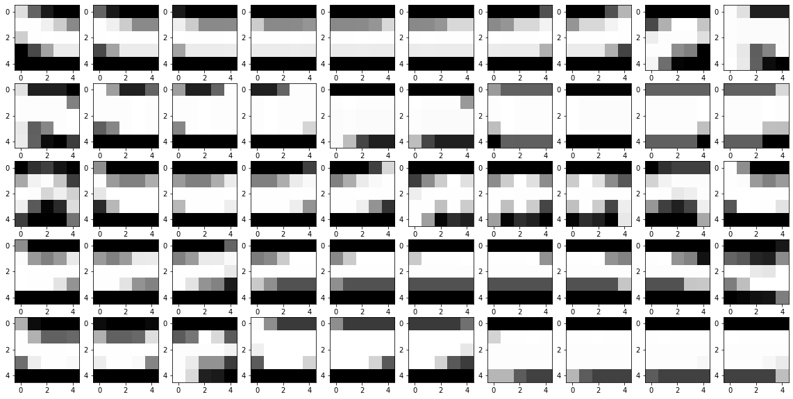
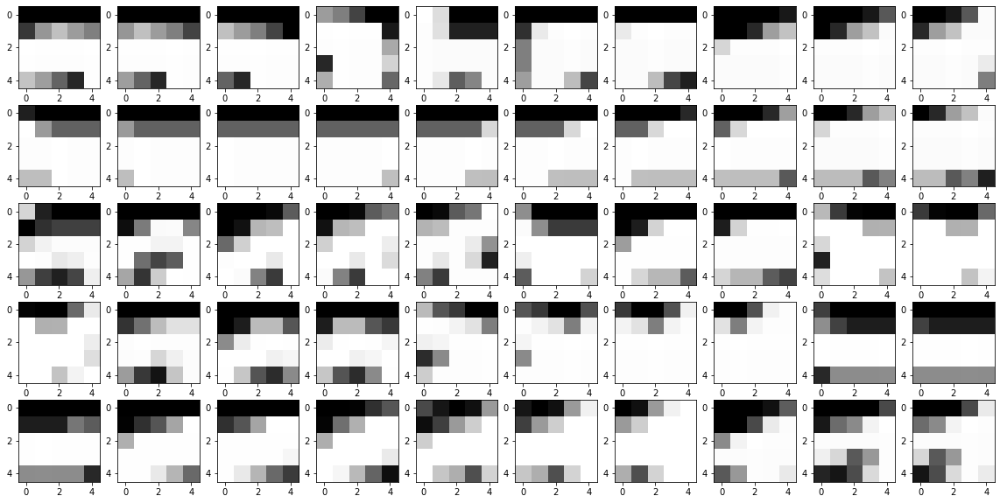
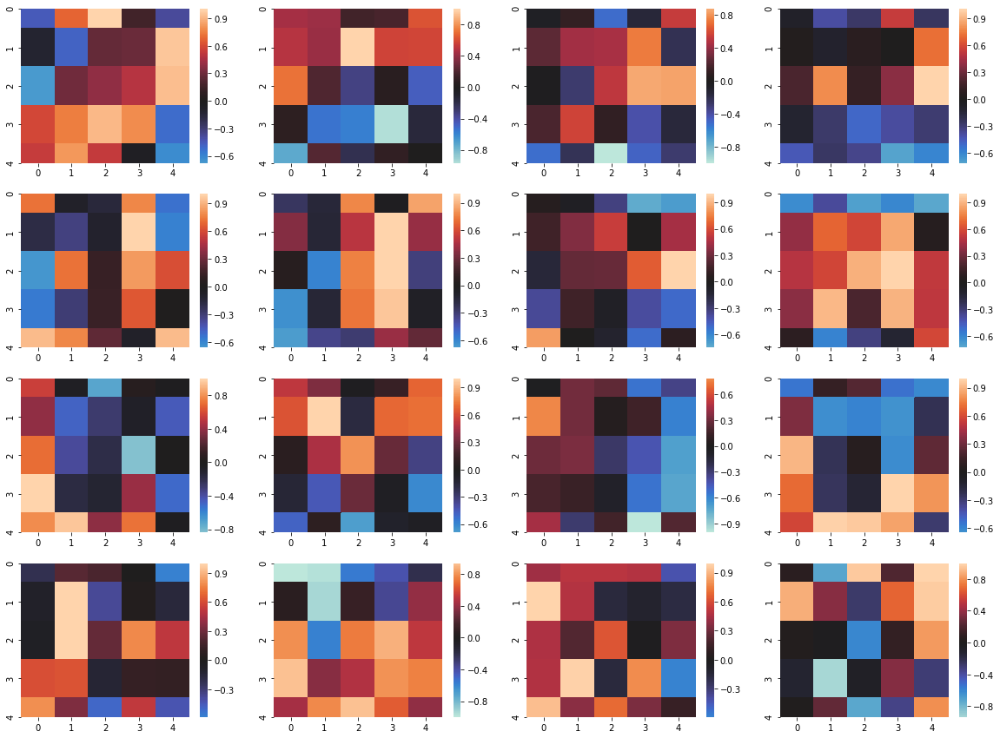
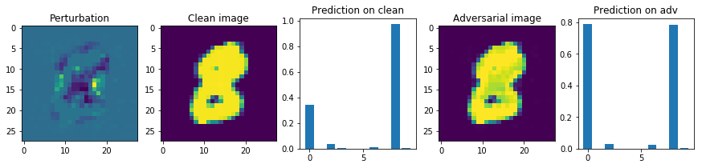
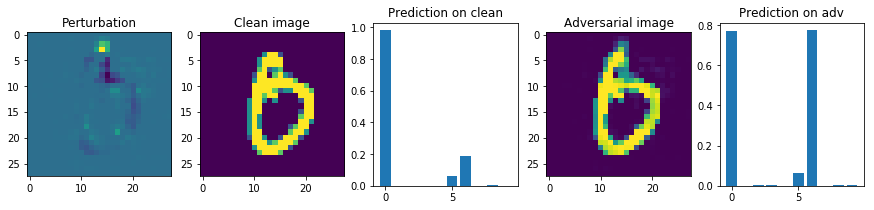
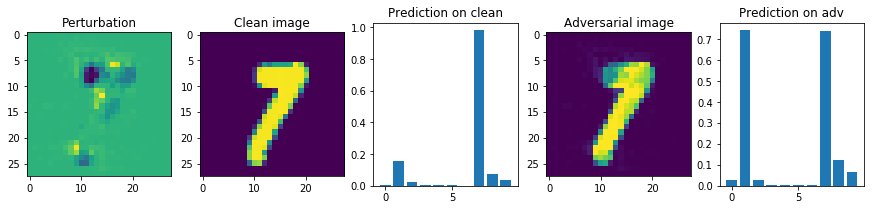

# Thu 3 Oct 2019

Trained a small CNN model on MNIST and extracted activations.

Looking at some samples, my hypothese of leaky formula seem to be true because 50% of the times,
the neuron has a weak activation of ~6% max activation.
Will need to do more quantitative evaluation...

Question: should an ideal pattern be sparse actually? 25 features (5x5 filter) are already small.
Perhaps superimposed patterns can't be disentangled by selecting sets of features to look at
but by assigning patterns to "subneurons" and maintaining them during refining.

Visualized patterns that activate my target neuron. Looks like there are several distinct patterns indeed.
One is a diagonal ridge, one is top-left corner, another for top horizontal edge and there are a few
cases of top-right corner as well.

Comparing the weights and patterns that end up activating the neuron the most (top 1%), we can see that
the weights are the average of a few distinct patterns:

- Weights: 
- Pattern 1: 
- Pattern 2: 
- Pattern 3: 

Apparently, when it comes to weights, you need the _oposite_ of sparsity.
A weight of zero means uncertainty and leaves wiggle room for attackers.
You need a way to encode multiple patterns with high certainty.

Other neurons show similar pattern of weights with a lot of uncertainty
and can't be mapped directly to a clear pattern of input. The following 
plot shows neuron weights scaled (but not translated) to fit within \[-1, 1\].
There are many black cells which stand for zero weights and all subplots
look like a patchwork without any discernible pattern.

A denser and more distinguishing neuron might result in _sparser_ activations
in the sense that it will return absolute zeros more often.

Given this analysis, tree models are not a good approach because they tend to 
encourage sparseness. We could throw away the idea of "disentangling" a network
into a better one but go directly to an architecture that encourages the
distintion and disentanglement of patterns.

# Sat 5 Oct 2019

Playing around with rectified log and maxout.

An immediate benefit of rectified log vs rectified linear is that the new activation function
creates nets that are less sensitive to initialization. Following 
[this blog post](https://towardsdatascience.com/weight-initialization-in-neural-networks-a-journey-from-the-basics-to-kaiming-954fb9b47c79), 
I tested how many layers one can propagate before the output explodes. ReLU get past 28 while
ReLog went through all 100 layers. Obviously, it can't solve the problem of too small activations,
it doesn't touch the left part of the plot.

Maxout seems to be effective in tearing out patterns but so is adding more neurons into the
_previous_ layer. This is based on my eye-balling, I'll need a quantitative way to measure it.

# Sun 6 Oct 2019

Fortified the training procedure with transformation of the input images: crop-resize, rotate,
random erasure, Gaussian noise. This should strengthen the baseline against adversarial examples
so that the comparison is valid.

Implemented another variant: sigmoid output with MSE loss. Because I'm testing the extent
neural nets resemble a set of logical propositions, each class should be a proposition
independent of the output of other classes. I also believe this loss is stricter than than
cross-entropy with softmax output and should help with fending off attacks.

TODO: defend the model further by generating counter-examples that don't belong to any of the
given classes (open-world setting).

# Wed 9 Oct 2019

Figured out a way to make relog more similar to sigmoid: changing it from:

    y = log10(relu(x)+1)
    
into:
    
    y = log10(relu(x)+0.01)+2
    
The results on adversarial examples increased to >60%, without other tricks :-O
This is huge... I will definitely write a paper!

Brought notebooks to Google colab to scale up experiments using GPUs. 
Things that took 20 min now finish in 45 sec! Having trouble 
with importing python files though.

Adjusted the relog formula a bit:

    y = log100(relu(x)+0.01)+1

The result with all the tricks except "strictening" is 90%. On adversarial
attack (fast gradient). Insane! Did I make a mistake somewhere?

Attempted my hand with [JSMA](jsma.ipynb) but got some TensorFlow/PyTorch
mismatch problem.

Had a big dose of literature. Added 15+ papers to "adversarial-examples"
folder in my Mendeley library.

C&W is a much stronger attack. My best performance is with 
`cnn-mnist-relog-minmaxout_4_2-sigmoid-out-strictening_0.1`
which is still fooled for 50% cases. Interesting that "strictening"
improves the robustness against C&W whereas it didn't have much
effect on FGSM. 

Is "tightening" a better name? Or logic regularization?

# Fri 11 Oct

Researching CIFAR-10. This is the first time that I read about it
in detail.

# Sat 12 Oct

Used a day to find [a good implementation](https://github.com/kuangliu/pytorch-cifar)
and adapt it to my need. Preliminary results seem to support my story
but it's running too slowly and Google Colab keeps breaking connection
to data storage.

Running [this notebook](https://colab.research.google.com/drive/1Kh0sTuEHXqNjGhEMBrOIHlxWK3UUWFRw#scrollTo=WKJDICIZlb9K&uniqifier=3)
to train some CIFAR models and using
[this one](https://colab.research.google.com/drive/1BXsR0s524p9lLeAvXwAAwgNm0SgJ4hOp#scrollTo=XH6gaV34Na-M)
to evaluate them against attacks.

State-of-the-art for CIFAR-10: https://paperswithcode.com/paper/adversarial-defense-by-restricting-the-hidden

TODO: polishing the C&W attack code
TODO: run one transfer attack and finish there

TODO: compare my "strictening" L1 and L2 with normal L1 and L2

# Sun 13 Oct

<s>Found out</s> why I got low results for ReLog on CIFAR: the initialization is bad so 
my models weren't learning. Spent an afternoon working on a new initialization formula
but didn't get any luck...

Found out why ReLog didn't work with CIFAR: negative numbers. 
With ReLog, positive weights encode positive atoms (found --> add score)
and negative ones encode negative atoms (found --> minus score).
But because of normalization to Gaussian distribution, the absence of a color
(which is used to be zero) becomes a strongly negative number. Meeting with this negative
number leads to a decrease in the final score whereas it should have had no effect.
Middle-strong color which should have mild effect now has no effect so the relationship
is all messed up. It has nothing to do with initialization (although a custom-made one might
perform better)!

Not sure how ReLU performs alright (even better) with negative numbers...

Everything seems to be working now, except that I can't wait long enough to see how 
models perform. It's time to get some GPU...?

# Mon 14 Oct

Made this image to illustrate the advantage of min/max (and/or):

# Tue 15 Oct

Realized that I could apply the kernel trick to filters to improve
the fit to eliptical point clouds. It does decrease the success rate
of C&W attack on MNIST from 58% (model=`cnn-mnist-relog-minmaxout_4_2-sigmoid-out-strictening_1.pkl`)
to 51% (model=`cnn-mnist-relog-kernel-minmaxout_4_2-sigmoid-out.pkl`).
However, two problems arise:

1. the regularization formula for linear model doesn't apply any more,
using it will actually make models _less_ robust
2. the loss blows up to infinity. Replacing Kaiming with dynamic 
initialization helps with the first epoch but the problem persists. 
Gradient clipping doesn't help. Perhaps this problem is related to 
the first problem...

ReLog helps with reigning in the loss, after adding it, the loss doesn't
explode any more but the deep model still struggle to learn...

# Sat 19 Oct

No, actually a quadratic kernel didn't have any negative effect. I got new
best result with it:

    Evaluating model: /content/gdrive/My Drive/Colab Notebooks/newlogic/output/cnn-mnist-relog-kernel-minmaxout_4_2-sigmoid_out-max_margin.pkl

    [INFO 2019-10-19 13:59:40,200 cleverhans] Constructing new graph for attack CarliniWagnerL2

    Accuracy: 0.560

I must have implemented something incorrectly before. Just to be sure...
the current commit is: 8433041fbf5eee2ab294b320faff2f81f6bfe833
Important notebooks:

- [training CNN on MNIST](notebooks/mnist_train.ipynb)
- [evaluating using FGM](notebooks/mnist_fgm.ipynb)
- [evaluating using C&W](notebooks/mnist_cw.ipynb)

Struggling to measure C&W accuracy on the full MNIST test set, it runs so
slowly...

# Sun 20 Oct

Looked at some examples of adversarial images generated by C&W and many of them make a lot of sense.
Here are some cherry-picked examples:

I think the not-so-strong performance is due to 
a lack of hyperparameter tuning instead of a fundamental problem.
Another thing I notice is although the (sigmoid) output is over-confident, if we
normalize them using softmax, we'll get close to 50% in all cases.

Got new results, every still makes sense. Got blocked from Google Colab
for running long-term jobs :)) Going to move to Cartesius anyway.

# Mon 21 Oct

If I report confidence, it needs to be under this attack:
https://github.com/tensorflow/cleverhans/blob/688fe64de5bda82895cc8729348a5d761c5e7813/cleverhans/attacks/max_confidence.py

In essence, attacks only work on the rate of fooling models but don't 
optimize the confidence on the fooled prediction so it's been known
before that we could "defend" models by confidence thresholding and
there was already a method to circumvent this defense.

Talked to Antske, agreed to cut it into a short paper and wrap it up ASAP.

Should I discuss the overfitting hypothesis of adversarial examples?
It was already discussed in Warde-farley and Goodfellow (2018), 
section 1.2.3 but maybe I could provide supporting evidence?

Warde-farley, D., & Goodfellow, I. (2018). Adversarial Perturbations of Deep Neural Networks. In Perturbations, Optimization, and Statistics. https://doi.org/10.7551/mitpress/10761.003.0012

Generalized [spherical units](notebooks/spherical_filters.ipynb) into
[elliptical units](notebooks/elliptical_filters.ipynb) such that 
it is possible to ignore certain input variable and the regularization
formulae become more natural.

Moving to Cartesius... the `environment.yaml` file wasn't useable 
(because... of course :-|) so I had to install packages manually.

# Tue 22 Oct

Training a few baseline model (VGG11 and VGG13) on Cartesius so that
I know what kind of performance can be expected in how much time.

    commit: 85ec98929bc2b2f9540765c850965f67b59b9537
    
    [minhle@int2 newlogic]$ sbatch scripts/train.job
    Submitted batch job 7008627

    results:
    tail -f output/train-vgg11.log
    tail -f output/train-vgg13.log

Initially, models fail to train. After much debugging, I found out that
it was due to an untested change I put it a while ago (gradient clipping 
to L_inf=5).

The script finishes 20 epochs quite fast... Trying deeper models:

    commit: ce8a08a0352f2d40ba0880bc8f896aa34812d67f

    [minhle@int2 newlogic]$ sbatch scripts/train.job
    Submitted batch job 7008708

    results:
    tail -f output/train-vgg16.log
    tail -f output/train-vgg19.log

Turns out that deeper models fail to learn. Is it because of numerical
stability? Reducing learning rate to 0.01.

    commit: bb6f5223633f941781f6b733c90ee688ddcebcb0

# Wed 23 Oct

The script managed to finish 50 epochs within 1 hour :-O 

    Started: Tue Oct 22 22:46:00 CEST 2019
    slurmstepd: error: *** JOB 7008708 ON gcn61 CANCELLED AT 2019-10-22T23:34:10 ***

Accuracy topped at epoch 49 of VGG16, reached 90%.

Unified APIs of two training services and two models so that my VGG models can use
the same modifications from the other models. Now that it's done, I can honestly write one
common description about the modifications in my paper.
After the extensive changes, it seems to work still:

    Epoch: 23
    0 / 391 : Loss: 0.241 | Acc: 91.406% (117/128)
    150 / 391 : Loss: 0.206 | Acc: 92.772% (17931/19328)
    300 / 391 : Loss: 0.217 | Acc: 92.309% (35565/38528)
    Test eval: Loss: 0.451 | Acc: 86.310% (8631/10000)

# Thu 24 Oct

Started training baseline models again:

    [minhle@int2 newlogic]$ squeue | grep minh
            7014019       gpu train-ci   minhle PD       0:00      1 (Priority)
            7014021       gpu train-mn   minhle PD       0:00      1 (Priority)

Managed to train miniatured CIFAR-10 models. Now starting to train the real things:

    commit: 318231e5c4dd9d4fe41fbfd2011f6d276cf2494c

    [minhle@gcn4 newlogic]$ drake output/ablation-cifar10
    The following steps will be run, in order:
    1: /nfs/home2/minhle/newlogic/././output/ablation-cifar10 <- /nfs/home2/minhle/newlogic/././train.py [timestamped]
    Confirm? [y/n] y
    Running 1 steps with concurrence of 1...

    --- 2. Running (timestamped): /nfs/home2/minhle/newlogic/././output/ablation-cifar10 <- /nfs/home2/minhle/newlogic/././train.py
    Submitted batch job 7017559
    Job submitted, please wait for >1 day
    --- 2: /nfs/home2/minhle/newlogic/././output/ablation-cifar10 <- /nfs/home2/minhle/newlogic/././train.py -> done in 0.24s
    Done (1 steps run).

TODO: compare neurons of ReLU and logic nets to see if the latter is
"more logic" (what would that mean...?)
--> Illustrating difference between distributed repr and localist repr:

    Interpolation plot: Plot activation along two axes: a digit x to a digit y and the same digit x to digit z. Distributed repr will result in smooth transition whereas localist repr small regions of strong activation surrounded by large swaths of zero activation.

# Fri 25 Oct 2019

ReLog models only get very poor results...

    [minhle@int1 newlogic]$ tail -n 2 output/ablation-cifar10/*.log
    ==> output/ablation-cifar10/cnn-relog.log <==
    Test eval: Loss: 4.415 | Acc: 36.610% (3661/10000)
    Model saved to /nfs/home2/minhle/newlogic/output/ablation-cifar10/cnn-relog.pkl

    ==> output/ablation-cifar10/cnn-relog-maxout_4.log <==
    150 / 391 : Loss: 1.622 | Acc: 39.238% (7584/19328)
    300 / 391 : Loss: 1.610 | Acc: 39.766% (15321/38528)

    ==> output/ablation-cifar10/cnn-relog-minmaxout_2_4.log <==
    150 / 391 : Loss: 2.118 | Acc: 17.219% (3328/19328)
    300 / 391 : Loss: 2.078 | Acc: 18.008% (6938/38528)

    ==> output/ablation-cifar10/cnn-relu.log <==
    Test eval: Loss: 0.694 | Acc: 90.840% (9084/10000)
    Model saved to /nfs/home2/minhle/newlogic/output/ablation-cifar10/cnn-relu.pkl

I had suspected that batchnorm would mess up with ReLog before... Since it doesn't fit
into the picture of logic-inspired network architecture. Without batchnorm, however,
the model wouldn't even train since the first epoch. I suspect that since weights and bias
are initialized around zero, and ReLU/ReLog is strictly positive, a majority of the neurons
are simply dead on the get-go because of too many negative weights... Since ReLU is unbounded,
strong activations can save some neurons but ReLog is roughly bounded on 1...
Fix: instead of BatchNorm, subtract 0.5 to all the output of ReLog. Trying it out:

    [minhle@int1 newlogic]$ sbatch scripts/debug.job
    Submitted batch job 7018130

The train/test accuracy increases until epoch 20 and then fluctuate till the last epoch...
Loss fluctuates too... Decrease learning rate, maybe?

Tried decreasing learning rate, enable "dynamic initialization" (though the implementation
is imperfect), but ReLog still doesn't train or display large fluctuation. I succeeded once
with ReLog+"quadratic", try again with elliptical maybe? Last successful training
(the path seems wrong but the architecture printed there clearly say that it's relog):

    %%time
    ts_relog.build_and_train('cnn-cifar10-relog-kernel', use_quadratic_kernel=True,
                            use_relog=True, strictening=0.01, use_sigmoid_out=True,
                            use_batchnorm=False, use_homemade_initialization=True)

    VGG(
    (features): Sequential(
        (0): QuadraticKernel()
        (1): Conv2d(6, 64, kernel_size=(3, 3), stride=(1, 1), padding=(1, 1))
        (2): ReLog(n=10.00)
        (3): MaxPool2d(kernel_size=2, stride=2, padding=0, dilation=1, ceil_mode=False)
        (4): QuadraticKernel()
        (5): Conv2d(128, 128, kernel_size=(3, 3), stride=(1, 1), padding=(1, 1))
        (6): ReLog(n=10.00)
        (7): MaxPool2d(kernel_size=2, stride=2, padding=0, dilation=1, ceil_mode=False)
        (8): QuadraticKernel()
        (9): Conv2d(256, 256, kernel_size=(3, 3), stride=(1, 1), padding=(1, 1))
        (10): ReLog(n=10.00)
        (11): QuadraticKernel()
        (12): Conv2d(512, 256, kernel_size=(3, 3), stride=(1, 1), padding=(1, 1))
        (13): ReLog(n=10.00)
        (14): MaxPool2d(kernel_size=2, stride=2, padding=0, dilation=1, ceil_mode=False)
        (15): QuadraticKernel()
        (16): Conv2d(512, 512, kernel_size=(3, 3), stride=(1, 1), padding=(1, 1))
        (17): ReLog(n=10.00)
        (18): QuadraticKernel()
        (19): Conv2d(1024, 512, kernel_size=(3, 3), stride=(1, 1), padding=(1, 1))
        (20): ReLog(n=10.00)
        (21): MaxPool2d(kernel_size=2, stride=2, padding=0, dilation=1, ceil_mode=False)
        (22): QuadraticKernel()
        (23): Conv2d(1024, 512, kernel_size=(3, 3), stride=(1, 1), padding=(1, 1))
        (24): ReLog(n=10.00)
        (25): QuadraticKernel()
        (26): Conv2d(1024, 512, kernel_size=(3, 3), stride=(1, 1), padding=(1, 1))
        (27): ReLog(n=10.00)
        (28): MaxPool2d(kernel_size=2, stride=2, padding=0, dilation=1, ceil_mode=False)
        (29): AvgPool2d(kernel_size=1, stride=1, padding=0)
    )
    (classifier): Sequential(
        (0): Linear(in_features=512, out_features=10, bias=True)
    )
    )

    Epoch: 0
    0 / 391 : Loss: 0.291 | Acc: 8.594% (11/128)
    150 / 391 : Loss: 0.109 | Acc: 9.799% (1894/19328)
    300 / 391 : Loss: 0.073 | Acc: 10.317% (3975/38528)
    Model saved to /content/gdrive/My Drive/Colab Notebooks/newlogic/output/cnn-cifar10-relu-kernel.pkl
    Test eval: Loss: 0.088 | Acc: 16.910% (1691/10000)

    Epoch: 1
    0 / 391 : Loss: -0.044 | Acc: 16.406% (21/128)
    150 / 391 : Loss: -0.077 | Acc: 21.740% (4202/19328)
    300 / 391 : Loss: -0.111 | Acc: 24.533% (9452/38528)
    Model saved to /content/gdrive/My Drive/Colab Notebooks/newlogic/output/cnn-cifar10-relu-kernel.pkl
    Test eval: Loss: 0.079 | Acc: 33.410% (3341/10000)

    Epoch: 2
    0 / 391 : Loss: -0.222 | Acc: 32.031% (41/128)
    150 / 391 : Loss: -0.254 | Acc: 32.776% (6335/19328)
    300 / 391 : Loss: -0.288 | Acc: 33.794% (13020/38528)
    Model saved to /content/gdrive/My Drive/Colab Notebooks/newlogic/output/cnn-cifar10-relu-kernel.pkl
    Test eval: Loss: 0.074 | Acc: 39.410% (3941/10000)

    Epoch: 3
    0 / 391 : Loss: -0.393 | Acc: 34.375% (44/128)
    150 / 391 : Loss: -0.428 | Acc: 37.221% (7194/19328)
    300 / 391 : Loss: -0.461 | Acc: 37.832% (14576/38528)
    Model saved to /content/gdrive/My Drive/Colab Notebooks/newlogic/output/cnn-cifar10-relu-kernel.pkl
    Test eval: Loss: 0.073 | Acc: 40.020% (4002/10000)

    Epoch: 4
    0 / 391 : Loss: -0.569 | Acc: 39.062% (50/128)
    150 / 391 : Loss: -0.601 | Acc: 39.280% (7592/19328)
    300 / 391 : Loss: -0.634 | Acc: 39.444% (15197/38528)
    Model saved to /content/gdrive/My Drive/Colab Notebooks/newlogic/output/cnn-cifar10-relu-kernel.pkl
    Test eval: Loss: 0.071 | Acc: 42.010% (4201/10000)

    Epoch: 5
    0 / 391 : Loss: -0.738 | Acc: 35.938% (46/128)
    150 / 391 : Loss: -0.773 | Acc: 40.910% (7907/19328)
    300 / 391 : Loss: -0.806 | Acc: 41.183% (15867/38528)
    Model saved to /content/gdrive/My Drive/Colab Notebooks/newlogic/output/cnn-cifar10-relu-kernel.pkl
    Test eval: Loss: 0.068 | Acc: 45.700% (4570/10000)

    Epoch: 6
    0 / 391 : Loss: -0.912 | Acc: 39.844% (51/128)
    150 / 391 : Loss: -0.945 | Acc: 42.979% (8307/19328)
    300 / 391 : Loss: -0.978 | Acc: 42.722% (16460/38528)
    Model saved to /content/gdrive/My Drive/Colab Notebooks/newlogic/output/cnn-cifar10-relu-kernel.pkl
    Test eval: Loss: 0.067 | Acc: 47.120% (4712/10000)

    Epoch: 7
    0 / 391 : Loss: -1.085 | Acc: 44.531% (57/128)
    150 / 391 : Loss: -1.116 | Acc: 43.771% (8460/19328)
    300 / 391 : Loss: -1.149 | Acc: 43.662% (16822/38528)
    Model saved to /content/gdrive/My Drive/Colab Notebooks/newlogic/output/cnn-cifar10-relu-kernel.pkl
    Test eval: Loss: 0.066 | Acc: 47.500% (4750/10000)

    Epoch: 8
    0 / 391 : Loss: -1.253 | Acc: 39.844% (51/128)
    150 / 391 : Loss: -1.288 | Acc: 44.655% (8631/19328)
    300 / 391 : Loss: -1.321 | Acc: 45.043% (17354/38528)
    Model saved to /content/gdrive/My Drive/Colab Notebooks/newlogic/output/cnn-cifar10-relu-kernel.pkl
    Test eval: Loss: 0.065 | Acc: 48.550% (4855/10000)

    Epoch: 9
    0 / 391 : Loss: -1.431 | Acc: 48.438% (62/128)
    150 / 391 : Loss: -1.459 | Acc: 45.778% (8848/19328)
    300 / 391 : Loss: -1.493 | Acc: 46.096% (17760/38528)
    Model saved to /content/gdrive/My Drive/Colab Notebooks/newlogic/output/cnn-cifar10-relu-kernel.pkl
    Test eval: Loss: 0.066 | Acc: 48.070% (4807/10000)

    Epoch: 10
    0 / 391 : Loss: -1.592 | Acc: 32.812% (42/128)
    150 / 391 : Loss: -1.632 | Acc: 47.139% (9111/19328)
    300 / 391 : Loss: -1.664 | Acc: 47.028% (18119/38528)
    Model saved to /content/gdrive/My Drive/Colab Notebooks/newlogic/output/cnn-cifar10-relu-kernel.pkl
    Test eval: Loss: 0.063 | Acc: 50.080% (5008/10000)

    Epoch: 11
    0 / 391 : Loss: -1.768 | Acc: 43.750% (56/128)
    150 / 391 : Loss: -1.803 | Acc: 47.698% (9219/19328)
    300 / 391 : Loss: -1.835 | Acc: 47.713% (18383/38528)
    Model saved to /content/gdrive/My Drive/Colab Notebooks/newlogic/output/cnn-cifar10-relu-kernel.pkl
    Test eval: Loss: 0.063 | Acc: 50.360% (5036/10000)

    Epoch: 12
    0 / 391 : Loss: -1.940 | Acc: 50.781% (65/128)
    150 / 391 : Loss: -1.974 | Acc: 48.789% (9430/19328)
    300 / 391 : Loss: -2.007 | Acc: 48.425% (18657/38528)
    Model saved to /content/gdrive/My Drive/Colab Notebooks/newlogic/output/cnn-cifar10-relu-kernel.pkl
    Test eval: Loss: 0.063 | Acc: 50.890% (5089/10000)

    Epoch: 13
    0 / 391 : Loss: -2.116 | Acc: 47.656% (61/128)
    150 / 391 : Loss: -2.146 | Acc: 49.519% (9571/19328)
    300 / 391 : Loss: -2.179 | Acc: 49.330% (19006/38528)
    Model saved to /content/gdrive/My Drive/Colab Notebooks/newlogic/output/cnn-cifar10-relu-kernel.pkl
    Test eval: Loss: 0.063 | Acc: 51.350% (5135/10000)

    Epoch: 14
    0 / 391 : Loss: -2.280 | Acc: 47.656% (61/128)
    150 / 391 : Loss: -2.317 | Acc: 50.326% (9727/19328)
    300 / 391 : Loss: -2.350 | Acc: 50.197% (19340/38528)
    Model saved to /content/gdrive/My Drive/Colab Notebooks/newlogic/output/cnn-cifar10-relu-kernel.pkl
    Test eval: Loss: 0.064 | Acc: 50.210% (5021/10000)

    Epoch: 15
    0 / 391 : Loss: -2.457 | Acc: 49.219% (63/128)
    150 / 391 : Loss: -2.461 | Acc: 52.266% (10102/19328)
    300 / 391 : Loss: -2.465 | Acc: 52.707% (20307/38528)
    Model saved to /content/gdrive/My Drive/Colab Notebooks/newlogic/output/cnn-cifar10-relu-kernel.pkl
    Test eval: Loss: 0.059 | Acc: 54.140% (5414/10000)

    Epoch: 16
    0 / 391 : Loss: -2.477 | Acc: 53.906% (69/128)
    150 / 391 : Loss: -2.480 | Acc: 53.730% (10385/19328)
    300 / 391 : Loss: -2.483 | Acc: 53.654% (20672/38528)
    Model saved to /content/gdrive/My Drive/Colab Notebooks/newlogic/output/cnn-cifar10-relu-kernel.pkl
    Test eval: Loss: 0.059 | Acc: 54.100% (5410/10000)

    Epoch: 17
    0 / 391 : Loss: -2.491 | Acc: 50.781% (65/128)
    150 / 391 : Loss: -2.497 | Acc: 53.710% (10381/19328)
    300 / 391 : Loss: -2.501 | Acc: 54.275% (20911/38528)
    Model saved to /content/gdrive/My Drive/Colab Notebooks/newlogic/output/cnn-cifar10-relu-kernel.pkl
    Test eval: Loss: 0.059 | Acc: 54.610% (5461/10000)

    Epoch: 18
    0 / 391 : Loss: -2.514 | Acc: 59.375% (76/128)
    150 / 391 : Loss: -2.514 | Acc: 54.372% (10509/19328)
    300 / 391 : Loss: -2.517 | Acc: 54.148% (20862/38528)
    Model saved to /content/gdrive/My Drive/Colab Notebooks/newlogic/output/cnn-cifar10-relu-kernel.pkl
    Test eval: Loss: 0.058 | Acc: 54.720% (5472/10000)

    Epoch: 19
    0 / 391 : Loss: -2.530 | Acc: 57.812% (74/128)
    150 / 391 : Loss: -2.531 | Acc: 54.491% (10532/19328)
    300 / 391 : Loss: -2.535 | Acc: 54.843% (21130/38528)
    Model saved to /content/gdrive/My Drive/Colab Notebooks/newlogic/output/cnn-cifar10-relu-kernel.pkl
    Test eval: Loss: 0.059 | Acc: 54.960% (5496/10000)
    CPU times: user 43min 23s, sys: 28min 29s, total: 1h 11min 52s
    Wall time: 1h 12min 27s

Recovered old versions of the code but couldn't reproduce the results.
Could it be that it was just a flux, an extremely lucky event when
the hyperparams were just right????? I wasn't too careful with versioning
then so it could also be it's just not the right version.

Anyhow, decided not to rely on luck... We know that relu can be trained well,
so we'll make an interpolation between relu and relog. Probably that would
solve the training stability problem, just like it did for elliptical units.

resubmitted:

    [minhle@int1 newlogic]$ drake output/ablation-cifar10
    which: no hadoop in (/hpc/sw/hpc/bin:/hpc/sw/hpc/sbin:/usr/lib64/qt-3.3/bin:/hpc/eb/compilerwrappers/compilers:/hpc/eb/compilerwrappers/linkers:/hpc/eb/modules-tcl-1.923/bin:/usr/local/bin:/usr/bin:/usr/local/sbin:/usr/sbin:/home/minhle/bin)
    which: no drip in (/hpc/sw/hpc/bin:/hpc/sw/hpc/sbin:/usr/lib64/qt-3.3/bin:/hpc/eb/compilerwrappers/compilers:/hpc/eb/compilerwrappers/linkers:/hpc/eb/modules-tcl-1.923/bin:/usr/local/bin:/usr/bin:/usr/local/sbin:/usr/sbin:/home/minhle/bin)
    The following steps will be run, in order:
    1: /nfs/home2/minhle/newlogic/././output/ablation-cifar10 <- /nfs/home2/minhle/newlogic/././train.py [timestamped]
    Confirm? [y/n] y
    Running 1 steps with concurrence of 1...

    --- 2. Running (timestamped): /nfs/home2/minhle/newlogic/././output/ablation-cifar10 <- /nfs/home2/minhle/newlogic/././train.py
    Submitted batch job 7020022
    Job submitted, please wait for >1 day
    --- 2: /nfs/home2/minhle/newlogic/././output/ablation-cifar10 <- /nfs/home2/minhle/newlogic/././train.py -> done in 0.19s
    Done (1 steps run).

# Sat 26 Oct

Nope, doesn't work. When ReLog kicks in around epoch 25, the performance starts
to degrade. So it's not about the initialization but the model is just too
restrictive.

I am ready to give up and cut half of my paper but want to try just another
variation, as close as possible to what works before: relog + unrestricted, 
unattenuated quadratic... Doesn't help :-(

Looking back, ReLog did kinda work... just not as well that I hoped. It could
be that the number of available patterns in the first layer (64) is simply too
restrictive. And batchnorm isn't that bad either. If you set the momentum high
enough (which translate into a small value in Pytorch), it's kind of stable.
And it could also be that ReLog actually don't like it too deep... The most 
successful experiment I did was with VGG11 where it reached 54% test acc at 
the 20th epoch. Anyhow, I don't have enough time to play with this...

Sometimes the _training_ loss decreases and accuracy increases until epoch 4-5
and then reverse course. Why?? A good training procedure should never increase
the loss... Maybe ADAM breaks down when ReLog is used?
Worst case scenario, if ReLog isn't useable in CIFAR-10 at all, I can still
try other methods such as elliptical and scramble training.

Found the culprit: ADAM! This whole sad saga could have been avoided if I didn't
change SGD into Adam but I might not have discovered ReLU-ReLog interpolation and 
restricting to the last layers. The former helps reache higher performance faster
and the latter brings us to higher performance eventually. I hope that the effect
on robustness is still there...

Managed to train a relog network (at least in the 4 last layers) to 88% on CIFAR-10:

    commit: 1f2ceae6627b3b9567eec29bd7baee80ca4f54fb

Running MNIST ablation:

    commit 4e476b9abd7883814029c9cb1bcf72f9dbc09e45
    Author: Minh Le <minhle.r7@gmail.com>
    Date:   Sat Oct 26 18:59:25 2019 +0200

        preparation for mnist ablation

    [minhle@int1 newlogic]$ drake output/ablation-mnist-models

    --- 3. Running (timestamped): /nfs/home2/minhle/newlogic/././output/ablation-mnist-models <- /nfs/home2/minhle/newlogic/././train.py
    Submitted batch job 7026289
    Job submitted, please wait for a few hours

Running CIFAR-10 ablation too:

    commit 9c57dc39c3dc952562f0f3ae334cfb404bd98740
    Author: Minh Le <minhle.r7@gmail.com>
    Date:   Sat Oct 26 23:54:01 2019 +0200

        fix model saving issue

    (venv) [minhle@gcn3 newlogic]$ drake output/ablation-cifar10-models
    --- 2. Running (timestamped): /nfs/home2/minhle/newlogic/././output/ablation-cifar10-models <- /nfs/home2/minhle/newlogic/././train.py
    Submitted batch job 7028204
    Job submitted, please wait for >1 day

Submitted a job for ablation evaluation:

    [minhle@int1 newlogic]$ drake output/ablation-mnist-results.json
    --- 4. Running (missing output): /nfs/home2/minhle/newlogic/././output/ablation-mnist-results.json <- /nfs/home2/minhle/newlogic/././output/ablation-mnist-models
    Submitted batch job 7029466

Finished most of them, except minmaxout because of "out of memory" error

# Sun 27 Oct

Figured out how to run SPSA on MNIST, job running:

    7035870       gpu attack-m   minhle  R    7:53:17      1 gcn8
    [minhle@int2 newlogic]$ wc -l output/ablation-mnist-results-spsa.json
    7 output/ablation-mnist-results-spsa.json

Can't run CIFAR-10 attacks fully on GPUs because of OOM error. Running
the defender model on CPU and the attacker model on GPU leads to even
lower a speed (CW):

    Batch: #0, accuracy: 0.00, std: 0.00, 85.7 secs/batch

Running both models on a CPU node, parallelizing attacks (BIM+CW):

    Batch: #0, accuracy: 0.00, std: 0.00, 25.8 secs/batch
    Batch: #0, accuracy: 0.00, std: 0.00, 31.3 secs/batch

Elliptical models fail to train on CIFAR-10:

    [minhle@int2 newlogic]$ grep "Test eval" output/ablation-cifar10-models/relog-elliptical-maxout_4.log
    Test eval: Loss: 1.679 | Acc: 39.090% (3909/10000)
    Test eval: Loss: 1.548 | Acc: 45.950% (4595/10000)
    Test eval: Loss: 1.555 | Acc: 44.270% (4427/10000)
    Test eval: Loss: 1.383 | Acc: 50.540% (5054/10000)
    Test eval: Loss: 1.858 | Acc: 37.940% (3794/10000)
    Test eval: Loss: 1.365 | Acc: 52.640% (5264/10000)
    Test eval: Loss: 1.873 | Acc: 38.000% (3800/10000)
    Test eval: Loss: 1.330 | Acc: 53.640% (5364/10000)
    Test eval: Loss: 2.095 | Acc: 25.090% (2509/10000)
    Test eval: Loss: 2.230 | Acc: 13.040% (1304/10000)
    Test eval: Loss: 2.125 | Acc: 19.000% (1900/10000)
    Test eval: Loss: 2.059 | Acc: 20.920% (2092/10000)

Perhaps the model is too restrictive... I'll relax it by training quadratic
instead.

    (base) Minhs-MacBook-Pro:newlogic cumeo$ git log | head
    commit 8fe9f350a5b65141cf39a9d6a87e4d1b40563f04
    Author: Minh Le <minhle.r7@gmail.com>
    Date:   Sun Oct 27 21:21:21 2019 +0100

        prepare to train quadratic models on cifar10

    [minhle@int2 newlogic]$ drake output/ablation-cifar10-models2
    --- 3. Running (missing output): /nfs/home2/minhle/newlogic/././output/ablation-cifar10-models2 <- /nfs/home2/minhle/newlogic/././train.py
    Submitted batch job 7036598
    Job submitted, please wait for >1 day

New idea: instead of scrambling, create all-negative examples by 
[overlaying two images of different classes](notebooks/overlay.ipynb).
Training a new model:

    output/ablation-mnist-models/relog-elliptical-maxout_4-sigmoid_out-max_fit_l1_1-overlay.log

Running evaluation, didn't make much of a difference from scrambling w.r.t. 
C&W and BIM but <s>seem to make a big jump for SPSA.</s>
--> EDITED: the big jump was due to smaller value of `nb_iters`

I seriously need to wrap things up...

Resubmitted attacks on CIFAR-10 models:

    (base) Minhs-MacBook-Pro:newlogic cumeo$ git log | head
    commit d5cbc96a7f7b87be784712427288bfc20898c8bf
    Author: Minh Le <minhle.r7@gmail.com>
    Date:   Mon Oct 28 01:51:35 2019 +0100

        plot distributed vs local, prepare to eval cifar

    [minhle@int2 newlogic]$ drake output/ablation-cifar10-results.json output/ablation-cifar10-results2.json

    --- 8. Running (missing output): /nfs/home2/minhle/newlogic/././output/ablation-cifar10-results.json <- /nfs/home2/minhle/newlogic/././output/ablation-cifar10-models
    Submitted batch job 7037467
    Job submitted, please wait for a few hours
    --- 9. Running (missing output): /nfs/home2/minhle/newlogic/././output/ablation-cifar10-results2.json <- /nfs/home2/minhle/newlogic/././output/ablation-cifar10-models2
    Submitted batch job 7037468
    Job submitted, please wait for a few hours

This model fails to train because of some grammatical mistake I recently 
introduced: `relog-quadratic-maxout_4-sigmoid_out-scrambling.log`.
Perhaps I'll want to run the "overlay" algorithm though.

# Mon 28 Oct

Gathering newest results... somehow, we're missing SPSA results for two models.

    (base) Minhs-MacBook-Pro:newlogic cumeo$ git log | head
    commit 7fcd33f22c1f8c0ecaa40a334151264de8b6a103
    Author: Minh Le <minhle.r7@gmail.com>
    Date:   Mon Oct 28 11:30:28 2019 +0100

        fix SPSA eval for two models
                
    [minhle@int1 newlogic]$ drake output/ablation-mnist-results2.json
    --- 6. Running (missing output): /nfs/home2/minhle/newlogic/././output/ablation-mnist-results2.json <- /nfs/home2/minhle/newlogic/././output/ablation-mnist-models
    Submitted batch job 7038310
    JobS submitted, please wait for a few hours

Rerun CIFAR-10 training:

    (base) Minhs-MacBook-Pro:newlogic cumeo$ git log | head
    commit 2278fca4d0c586539cf441154e1f9c5e68289013
    Author: Minh Le <minhle.r7@gmail.com>
    Date:   Mon Oct 28 16:11:20 2019 +0100

        prepare to train cifar-10

    [minhle@int1 newlogic]$ drake output/ablation-cifar10-models output/ablation-cifar10-models2
    --- 2. Running (missing output): /nfs/home2/minhle/newlogic/././output/ablation-cifar10-models <- /nfs/home2/minhle/newlogic/././train.py
    Submitted batch job 7040122
    Job submitted, please wait for >1 day
    --- 3. Running (missing output): /nfs/home2/minhle/newlogic/././output/ablation-cifar10-models2 <- /nfs/home2/minhle/newlogic/././train.py
    Submitted batch job 7040123
    Job submitted, please wait for >1 day

Submitting a new job for max confidence attack:

    (base) Minhs-MacBook-Pro:newlogic cumeo$ git log | head
    commit 5f7a901ee8242b98a1ea05123b87d85cc20fc53d
    Author: Minh Le <minhle.r7@gmail.com>
    Date:   Mon Oct 28 23:13:38 2019 +0100

        better plots, max confidence attack

    [minhle@int2 newlogic]$ drake output/ablation-mnist-results3.json
    --- 7. Running (missing output): /nfs/home2/minhle/newlogic/././output/ablation-mnist-results3.json <- /nfs/home2/minhle/newlogic/././output/ablation-mnist-models
    Submitted batch job 7040880
    Jobs submitted, please wait for a few hours

# Tue 29 Oct

CIFAR-10 models finished training.

    [minhle@int2 newlogic]$ tail -n 5 output/ablation-cifar10-models*/*.log
    ==> output/ablation-cifar10-models2/relog-quadratic-max_fit_l2-maxout_4.log <==
    300 / 391 : Loss: 0.099 | Acc: 96.452% (37161/38528)
    Test eval: Loss: 0.482 | Acc: 87.200% (8720/10000)

    ==> output/ablation-cifar10-models2/relog-quadratic-max_fit_l2-maxout_4-sigmoid_out.log <==
    300 / 391 : Loss: 0.036 | Acc: 74.234% (28601/38528)
    Test eval: Loss: 0.038 | Acc: 72.840% (7284/10000)

    ==> output/ablation-cifar10-models2/relog-quadratic-max_fit_l2-maxout_4-sigmoid_out-overlay.log <==
    300 / 391 : Loss: 0.039 | Acc: 72.210% (27821/38528)
    Test eval: Loss: 0.055 | Acc: 68.970% (6897/10000)

    ==> output/ablation-cifar10-models2/relog-quadratic-max_fit_l2-maxout_4-sigmoid_out-scrambling.log <==
    300 / 391 : Loss: 0.036 | Acc: 74.356% (28648/38528)
    Test eval: Loss: 0.066 | Acc: 58.380% (5838/10000)

    ==> output/ablation-cifar10-models/relog.log <==
    300 / 391 : Loss: 0.106 | Acc: 96.270% (37091/38528)
    Test eval: Loss: 0.458 | Acc: 87.490% (8749/10000)

    ==> output/ablation-cifar10-models/relog-maxout_4.log <==
    300 / 391 : Loss: 0.093 | Acc: 96.782% (37288/38528)
    Test eval: Loss: 0.472 | Acc: 87.330% (8733/10000)

    ==> output/ablation-cifar10-models/relog-minmaxout_2_4.log <==
    300 / 391 : Loss: 0.191 | Acc: 93.475% (36014/38528)
    Test eval: Loss: 0.518 | Acc: 85.180% (8518/10000)

    ==> output/ablation-cifar10-models/relog-minmaxout_2_4-max_fit_l2.log <==
    300 / 391 : Loss: 0.184 | Acc: 93.537% (36038/38528)
    Test eval: Loss: 0.459 | Acc: 86.230% (8623/10000)

    ==> output/ablation-cifar10-models/relu.log <==
    300 / 391 : Loss: 0.069 | Acc: 97.501% (37565/38528)
    Test eval: Loss: 0.515 | Acc: 87.190% (8719/10000)

<s>Got max-confidence results, it turns out sigmoid out and negative training is actually quite effective</s> --> [checked on clean images](notebooks/check-prediction-probs.ipynb),
sigmoid out generally give low probability, both on training and test set.

It could be because the positive label is drown out by 9 others for every image.
Sigmoid out models perform poorly on CIFAR-10, perhaps that's related?
Should I "fix" it? What if uncertainty is a virtue?

Submitted evaluation:

    [minhle@int2 newlogic]$ drake output/ablation-cifar10-results.json output/ablation-cifar10-results2.json

    --- 9. Running (missing output): /nfs/home2/minhle/newlogic/././output/ablation-cifar10-results.json <- /nfs/home2/minhle/newlogic/././output/ablation-cifar10-models
    Submitted batch job 7044401
    Submitted batch job 7044402
    Jobs submitted, please wait for a few hours

    --- 10. Running (missing output): /nfs/home2/minhle/newlogic/././output/ablation-cifar10-results2.json <- /nfs/home2/minhle/newlogic/././output/ablation-cifar10-models2
    Submitted batch job 7044403
    Submitted batch job 7044404

